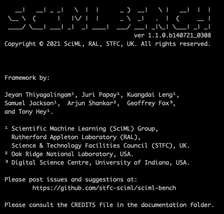
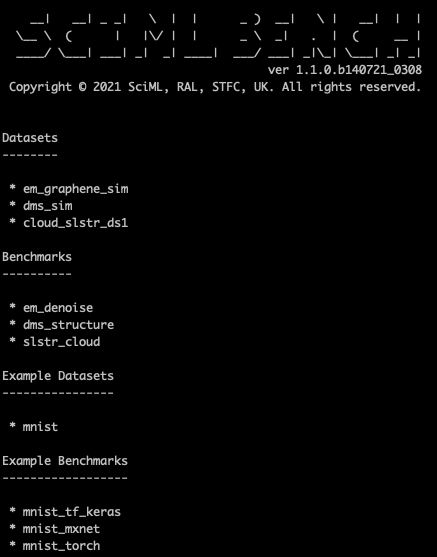

# Using & Contributing to SciML-Bench: A Tutorial 

Before proceeding with this tutorial, please ensure that the framework has been installed. Please consult the [Installation](./installation.md) documentation for more details. In addition to this, the general usage is outlined [here](./usage.md). This tutorial is intended to demonstrate these with examples packaged with the framework.  We recommend following all of them in order, until you feel comfortable of using the framework or contributing to the benchmarks.

# Using SciML-Bench through Command Line Interface (CLI)


## Environment

We strongly advice you to create a sandboxed environment before using the benchmark suite, ideally in a *conda* environment or *pyenv*.  We also recommend Python 3.9. Let's assume  that the name of the sandboxed environment is "bench", to mark benchmarking. To start with

```
conda create --name bench python=3.9 -y
```

This should create the environment 'bench' with Python 3.9. Switch to this environment using 

```
conda activate bench
```
With this, you should see the active environment as 'bench'. If not sure, you can verify this using the command 

```
conda info
```

or 

```
echo $CONDA_PREFIX
```

## Installing the Benchmark 

Once the environment is active, change the active directory where the sources are (where you should see the README.md file). 

Issue the following command to install the SciML-Bench.

```
pip install --use-feature=in-tree-build . 
```

This should install the benchmark framework without any issues. 

## Verifying the installation 

There are several ways to verify the installation, but an easier one is to use the `about` command as follows:

```bash
sciml-bench about
```

This should produce an output similar to the one below. 



Another option is to use the `--version` option as follows: 

```bash
sciml-bench --version
```
producing the following looking output: 


Another method to verify the installation is to use the `--help` option using the command `sciml-bench --help`, which produces the following looking output: 


Here, across all these commands, the exact reported version of the framework may vary, and can safely be ignored.

## Listing and verifying entities

Successful installation of the framework does not guarantee successful installation of the entities, such as benchmarks and datasets. As the exact benchmarks that each user wanting to evaluate or run may vary greatly, the framework does not install these. Available entities can be listed using the `list` command. In other words, running the `sciml-bench list` should produce a following  (or similar) output.



It is worth noting that benchmarks and datasets are split into production level benchmarks/datasets and example benchmarks/datasets. The latter is used to provide very simple examples to demonstrate the applicability of the framework. Further options for any command can be found by supplying the `--help` option to any command. For example, `sciml-bench list --help` or `sciml-bench download --help` and alike.  

We can list only the datasets using the command 

```
sciml-bench list datasets
```

which produces the following output: 


Similarly, benchmarks and examples can be listed using the commands `sciml-bench list benchmarks` and `sciml-bench list examples`, respectively.

The installed benchmarks and downloaded datasets can be verified using the `--verify` option for the list command, so that the command looks like 

```
sciml-bench list --verify
``` 

This should produce an output similar to the one below. 


It is worth noting several states of the datasets and benchmarks, such as 'Downloaded', 'Not downloaded', 'Runnable' and 'Not runnable'. The status of a dataset can either be 'Downloaded', 'Not downloaded', indicating the local availability of the dataset. Similarly, status of a benchmark can either be 'Runnable' or 'Not runnable'. Benchmarks are not runnable until they have been explicitly installed (see below). We will use the *em_denoise* benchmark and the associated dataset *em_graphene_sim* to demonstrate downloading and installation operations, but can be extended to other or all datasets. We recommend using the `--verify` option every time a benchmark is installed. 

<br>
<br>


## Listing Dependencies 

As highlighted in the main documentation, benchmarks rely on one or more datasets and other python packages. These dependencies can be listed using the `--deps` option to the `list` command. For example, 

<br>

```
sciml-bench list --deps 
```

should produce an output similar to the following: 


<br>
<br>

You must be able to observe both dataset and package dependencies of each of the benchmarks. 

## Downloading Datasets 

Datasets have to be locally available before running any benchmark, and thus must be downloaded beforehand using the `download` command. 


Let's assume that we would like run the *em_denoise* benchmark. However, this requires the relevant datasets to be in place, namely, the *em_graphene_sim* dataset. Any dataset can be downloaded using the `download` command, in the format of `sciml-bench download [OPTIONS] DATASET_NAME`, where you are expected to specify the dataset names. This can be any of the following:

1. A single dataset (available via `sciml-bench list datasets` command). An example is: `sciml-bench download em_graphene_sim`. 
1. More than one dataset, as a comma-separated list. An example is: 
`sciml-bench download em_graphene_sim,dms_sim
1. Using the `all` keyword, which will download all datasets. An example is: 
`sciml-bench download all`. 


Although benchmarks are listed as part of the `list` command, they are not downloadable entities. You codebase contains all benchmarks and they do not have to be downloaded separately. 

Let us assume that we would like to download the *em_graphene_sim* dataset. Issue the following command at the command prompt. 

```
sciml-bench download em_graphene_sim
``` 

This will immediately begin the download process, resulting in an output like the following:


<br> 
<br> 

The downloaded files are kept in the default dataset folder, which is usually *{HOME}/sciml_bench/datasets*. This location can be modified in two different ways: 

1. Method 1: Specify the location through the `--dataset_dir` option. If omitted, the location from the configuration file will be used. 

1. Method 2: Modify the Configuration file. Please see the [Configuration File](./configuration.md) to see how this can be achieved.  


In the examples that follow this, we will be omitting this option of `--download_dir`, but if desired, you can specify this. For example

```
sciml-bench download em_graphene_sim --download_dir /tmp/emg
```

or similar. 

In the example above, as can be observed, the download command downloaded the dataset in foreground (i.e. interactive) mode. However, this is not possible for all datasets, particularly, where datasets are very large.  In those instances, the download command can be launched with the `--mode` option, where it is possible to force the framework to download the dataset in background mode. The `--mode` option can take either `foreground` (default when not using the `--mode` option) or `background` as possible values.  The `--mode background` starts downloading the dataset in background mode and immediately releasing the terminal window. For example, the command 

```
sciml-bench download --mode background em_graphene_sim
```

produces the following output:


<br><br>


Then the download log can be inspected to see whether the download is complete. There will not be any alerts to the window.  Full details of the `download` command can be found via the `--help` flag. i.e. 


```
sciml-bench download --help
```

Then running the `sciml-bench list --verify` command is useful to know the status of the datasets. However, the `--verify` option does not verify the integrity of individual files. This may be supported in future versions. 


<br>

## Finding More about Datasets

In addition to the `list` command the `info` command can be used  for obtaining short description around each dataset. The documentation on datasets provide a full coverage around each dataset. To use the `info` command, issue the following command:

```
sciml-bench info <DATASET_NAME>
```

where <DATASET_NAME> is one of the datasets supplied by the SciML-Bench. for example, the following command sows the information for the *em_denoise* benchmark

```
sciml-bench info em_graphene_sim
```

This displays a limited information around the *em_graphene_sim* benchmark. The example output for the above command will look like the following: 


<br>

## Installing Benchmarks

As highlighted before, the `list --verify` or `list --deps` commands can provide the status of the benchmarks (as *runnable* or *not runnable*). Each benchmark comes with its own set of dependencies (python packages), and these are not installed by default. For this reason, each benchmark must be installed separately, which will force relevant dependencies to be installed. An example is:

```
sciml-bench install em_denoise
```

This command will automatically read and install relevant dependencies (as per the configuration file) for the *em_denoise* benchmark. A sample output will look like the following: 


<br>
<br>
Again, as highlighted before, the version, and the exact location of the logs are not important here.  The log file contains very detailed installation messages.  Instead of a single benchmark, multiple benchmarks can be specified, such as 

<br>

```
sciml-bench install all
```
<br>


or

```
sciml-bench install em_denoise,dms_scatter
```

## Finding More about Benchmarks

Benchmarks are runnable entities, with dependencies on a number of packages, datasets and contains many tunable parameters. The SciML-Bench framework provides a number of commands to obtain various pieces of information about a given benchmark. These, however, do not replace the documentation. Therefore, we recommend using these in conjunction with the documentation.  

The `info` command used to find information about datasets can also be used for obtaining a short description around each benchmark. The documentation on benchmarks provide a full coverage of various options for each and every benchmark. To use the `info` command,

```
sciml-bench info em_denoise
```

This displays a limited information around the *em_denoise* benchmark. The example output for the above command will look like the following: 


## Running Benchmarks

Once the benchmarks are installed, please issue the `list` command with `--verify` option, which will indicate whether each benchmark is runnable or not. There can be several reasons for a benchmark to be marked as *not runnable*, including

1. The benchmark has not been installed (i.e. missing dependencies),
1. The relevant datasets have not been downloaded,
1. The benchmark fails to launch (due to conflicting dependencies or invalid command or similar). This situation is very rare, and we encourage you to contact us. 

Let's assume  that the command `sciml-bench list --verify` lists the *em_denoise* benchmark as runnable. In other words, the dataset *em_graphene_sim* must also have been downloaded. This can be seen in the list,  as in the figure below.


<br>
<br>

The *Runnable (Training & Inference)* indicates that the benchmark can be run either in training mode or in inference mode.  

### Running Benchmarks on Training Mode

The benchmark can be run in a number of different ways.  Simply issuing the `run` command without any extra arguments results in default arguments being used, namely, 

* The given benchmark will run on training mode using default parameters (such as learning rate, batch size, etc.)
* Outputs will be stored in `~/sciml_bench/outputs/<benchmark_name>/<yyyymmdd>/training` or `../inference` directories. These include benchmark runs, logs, saves models and training or inference history.  
* Will use the datasets from the default dataset folder, which is, `~/sciml_bench/datasets/<benchmark_name>

To run the *em_denoise* benchmark with default settings, 

```
sciml-bench run em_denoise
```

An example output of a run will  look like the following:


Once you are comfortable with the default runs, you can begin to alter the defaults.  Since the default running mode is training, the following two commands are equivalent: 

```
sciml-bench run em_denoise
```

and 

```
sciml-bench run em_denoise --mode training em_denoise
```

For example, if you desire, you can specify an output directory using the `output_dir` option to the `run` command, as follows: 

```
sciml-bench run --mode training --output_dir /tmp/emgx-out em_denoise
```

We can also specify a custom dataset folder, for instance, if you have downloaded that to a different directory using the `--dataset_dir` option. The following two commands are identical: 

```
sciml-bench run --mode training --dataset_dir ~/sciml_bench/datasets/em_graphene_sim --output_dir /tmp/emgx-out em_denoise
```

and

```
sciml-bench run  --output_dir /tmp/emgx-out em_denoise
```

Finally, you can specify benchmark-specific arguments using the `-b` (or `--benchmark_specific`) flag. For instance, to set the number of epochs to 10 (instead of default 2), and the learning rate to 0.001 (instead of default 0.01) for the *em_denoise* benchmark, the following command can be used


```
sciml-bench run  -b batch_size 4 -b lr 0.001 em_denoise
```


Please explore the additional options using the `--help` option as follows: 

```
sciml-bench run --help
```


### Running Benchmarks on Inference Mode

You run a benchmark on inference mode, you need to:

1. have access to the model files (including the architecture and weights), and 
1. have some datasets on which you would like to run the inference on. 


Each benchmark varies how they store the model files. For the case of *em_denoise* benchmark, this is stored as a single HDF file (with an extension of `.h5`) inside the outputs directory (which you can move this around). You cannot run a benchmark in inference mode without access to this model file.  Similarly, each benchmark varies how they expect the datasets for inference, and this varies across benchmarks. Please consult the documentation to know the expected data formats of benchmarks for inference. The suite includes some sample inference datasets. The *em_denoise* benchmark expects the inference datasets in single channel PNG format with the resolution of $256\times 256$.  


For this example, let's assume:

* That you have access to the trained the model, and  full path to the trained model is: `~/sciml_bench/outputs/em_denoise/20210720/training/em_denoise_model.h5`.
* Inference datasets (an array of PNG images) are stored at /tmp/emd/inference 

With this, we can run the benchmark in inference mode as follows. 

```
sciml-bench run --mode inference \
                --model ~/sciml_bench/outputs/em_denoise/20210720/training/em_denoise_model.h5 \
                --dataset_dir /tmp/emd/inference \
                em_denoise 
```

*** More to do ***

